

	

## 👨‍💻 About Me

I'm a seasoned **Senior Software Engineer** with **10+ years of experience** in building intelligent full-stack systems with **Web3** and **AI** integrations.

### 🔍 Professional Focus

- **Full-Stack Development**: Building robust applications with modern frameworks and best practices
- **AI/ML Engineering**: Developing and deploying intelligent systems using TensorFlow, PyTorch, and LangChain
- **Blockchain Development**: Smart contract development, DApp architecture, and Web3 integration
- **SportsBook and Casino**:
  BetsApi, Betradar, BetEXCH, Betfaire, Lsports API integration, Fair Web game development (Blackjack, Poker, Roulette, Crash, Coinflip, Hilo, etc), Ezugi, Vivo, Sagaming, TVBET, Live Games, Evolution, Betsoft, NSoft, Hog, NetGame
- **Cloud & DevOps**: Expertise in AWS, GCP, Azure, Kubernetes, and CI/CD pipelines
- **Performance Optimization**: Architecting scalable systems that handle millions of users

---

### 🏅 HackerRank Certificates

<table>
	<tr>
		<td>
			
		</td>
		<td>
			
		</td>
		<td>
			
		</td>
	</tr>
	<tr>
		<td>
			<a href="https://www.hackerrank.com/certificates/59f538cc75f1" target="_blank">
				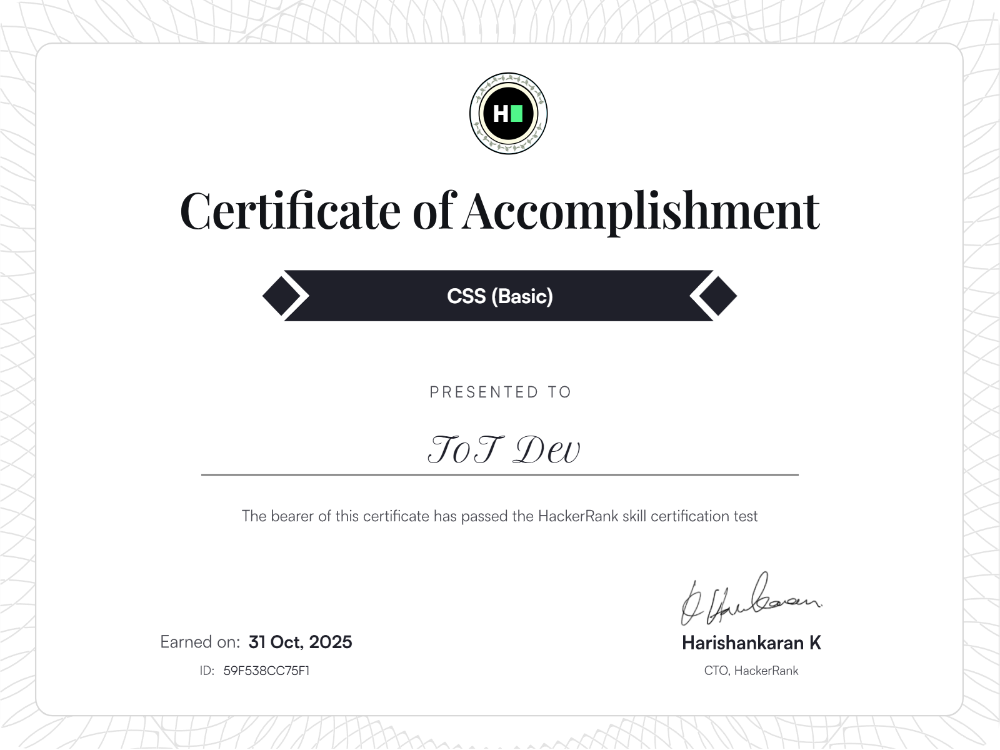
			</a>
		</td>
		<td>
			
		</td>
		<td>
			<a href="https://www.hackerrank.com/certificates/08d03bc42179" target="_blank">
				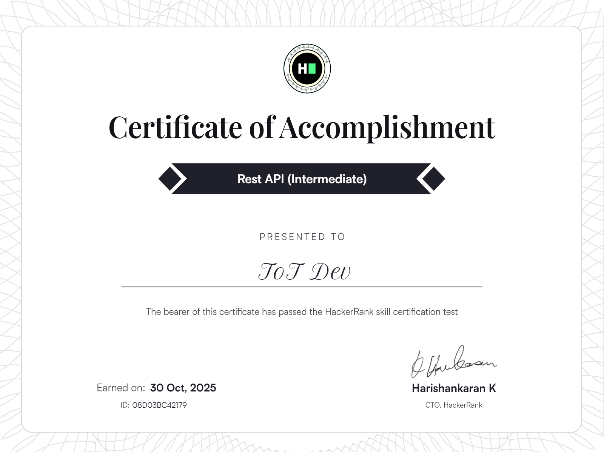
			</a>
		</td>
	</tr>
	<tr>
		<td>
			
		</td>
		<td>
			<a href="https://www.hackerrank.com/certificates/6b9cddb5152e" target="_blank">
				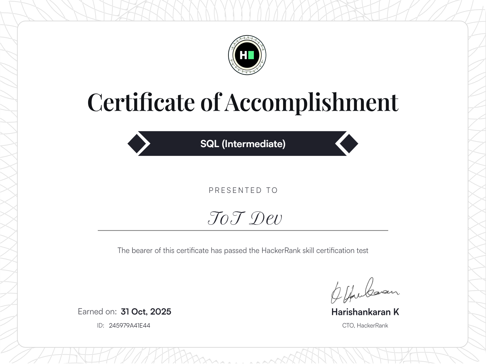
			</a>
		</td>
		<td>
			
		</td>
	</tr>
	<tr>
		<td>
			<a href="https://www.hackerrank.com/certificates/bebcdaaffc25" target="_blank">
				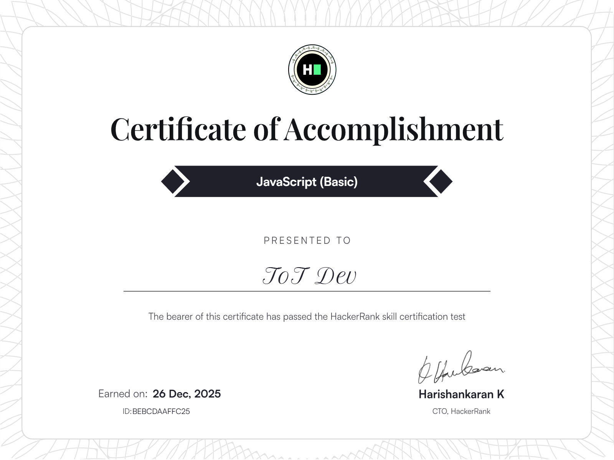
			</a>
		</td>
		<td>
			
		</td>
		<td>
			
		</td>
	</tr>
	<tr>
		<td>
			
		</td>
		<td>
			<a href="https://www.hackerrank.com/certificates/bcdfec112699" target="_blank">
				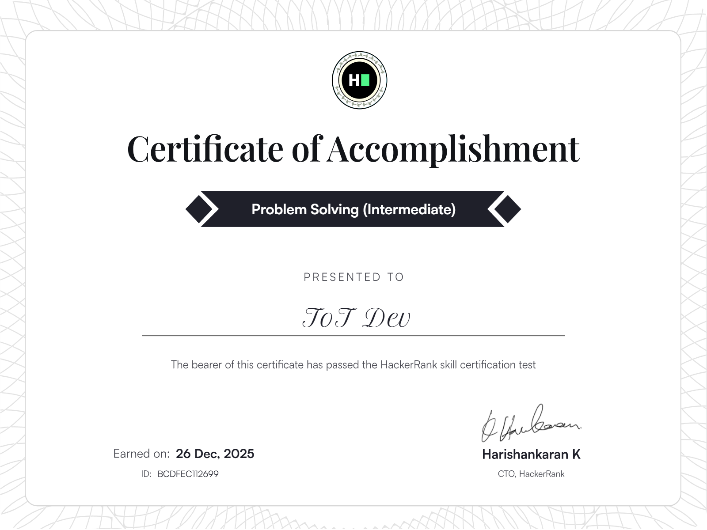
			</a>
		</td>
		<td>
			<a href="https://www.hackerrank.com/certificates/74312df04287" target="_blank">
				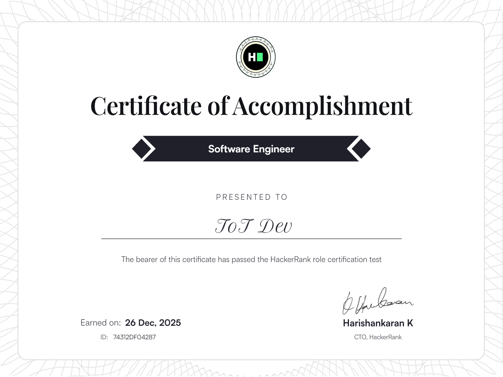
			</a>
		</td>
	</tr>
</table>

---

# <i>🌟 Featured Projects</i>

	

	
	<h3><u><strong><i>Metahorse</i></strong></u></h3>
	

		MUNITY Ecosystem is an interconnected blockchain gaming platform that brings multiple immersive titles—Stutengarden, MetaHorse Unity, and M-Deeds—into a single, seamless experience powered by the $MUNITY token. The platform allows players to explore shared virtual worlds, make meaningful choices, and participate in a unified economy that connects gameplay across all titles. 
		At the heart of the ecosystem is a Legendary NFT Marketplace, where players can trade horses, consumables, and in-game assets using cryptocurrency, ensuring true ownership and a player-driven economy. Advanced features like staking and farming on the Sepolia testnet reward users with Munity Medal Points after the Token Generation Event (TGE), creating long-term engagement and value for the community. 
		Built with modern web and blockchain technologies, MUNITY integrates Web3 wallets, smart contracts, and a scalable frontend architecture, delivering a secure, fluid, and engaging experience. The ecosystem is designed for growth, with future potential for additional interconnected games, cross-chain support, advanced DeFi mechanics, DAO-based governance, and deeper player-driven economies—positioning MUNITY as a next-generation, community-owned gaming metaverse.
	

	

	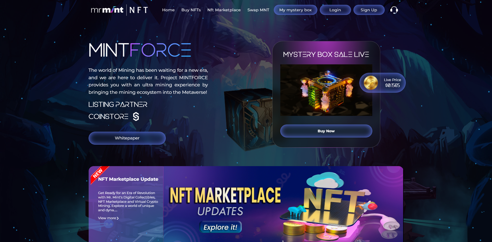
	<h3><u><strong><i>NFT Marketplace</i></strong></u></h3>
	

		Mr. Mint’s NFT Marketplace is an innovative Web3 platform that bridges the worlds of digital collectibles and cryptocurrency mining, creating a unique ecosystem where blockchain technology meets real-world value. The platform allows users to mint, trade, and own NFTs that are directly linked to real-world mining activities, ensuring authenticity, transparency, and a secure experience for every participant. 
		By integrating blockchain at its core, the marketplace provides users with true ownership of digital assets, a seamless trading experience, and the confidence that their collectibles have verifiable value. Beyond the technical infrastructure, Mr. Mint’s NFT Marketplace emphasizes engagement and community, offering opportunities for gamification, interactive features, and events that foster a vibrant network of collectors and crypto enthusiasts. 
		The platform is designed for long-term growth and scalability, with potential to integrate advanced blockchain features, expand into new digital assets, and introduce community-driven initiatives. This positions Mr. Mint’s NFT Marketplace as not just a trading platform, but a dynamic ecosystem where digital ownership, blockchain innovation, and community engagement converge to redefine the Web3 experience.
	

	

	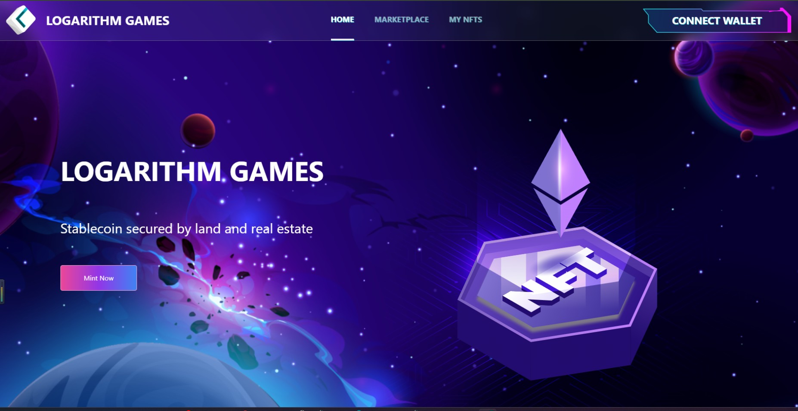
	<h3><u><strong><i>LOGARITHM GAMES Mint  (NFT Mint : BNB)</i></strong></u></h3>
	

		LOGARITHM GAMES NFT Minting Platform is a full-stack Web3 application designed to empower users to mint, list, and trade NFTs using BNB tokens within a decentralized marketplace environment. I led both the frontend development and smart contract implementation, ensuring smooth, secure, and seamless interactions between the user interface and the blockchain layer. 
		Built with React for the frontend and Solidity for backend smart contracts, the platform delivers core Web3 functionalities including wallet integration, NFT minting, listing, buying and selling, and real-time contract interactions. By leveraging decentralized storage solutions like IPFS for metadata and asset hosting, the platform ensures transparency, security, and scalability in managing digital assets. 
		The architecture is designed for long-term growth and adaptability, supporting future enhancements such as multi-chain compatibility, advanced marketplace features, refined UI/UX flows, and deeper DeFi integrations. This positions the platform as a robust foundation for blockchain gaming ecosystems and NFT-driven digital economies, offering users a seamless gateway into the next generation of decentralized digital experiences.
	

	

	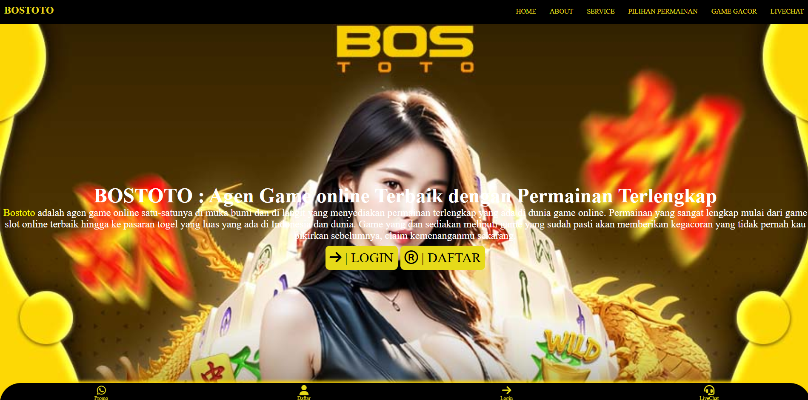
	<h3><u><strong><i>Magnum AI</i></strong></u></h3>
	

		Magnum AI is a cutting-edge platform that leverages advanced technology to provide users with a seamless, secure, and real-time online lottery and betting experience across multiple international markets. I developed the platform with a focus on reliability and user trust, implementing robust backend systems, secure payment gateways, real-time updates, user authentication, and data encryption to ensure a safe and transparent environment for every participant. 
		Built to handle high-volume transactions and real-time interactions, Magnum AI delivers a smooth and responsive user experience while maintaining stringent security standards. The platform is designed for scalability and growth, with opportunities to expand by integrating additional betting options, enhancing mobile accessibility, and incorporating advanced analytics to provide personalized experiences tailored to user behavior and preferences. 
		Magnum AI positions itself as a next-generation, technology-driven solution in the online lottery and betting space, combining security, speed, and innovation to create a trustworthy and engaging ecosystem for users worldwide.
	

	

	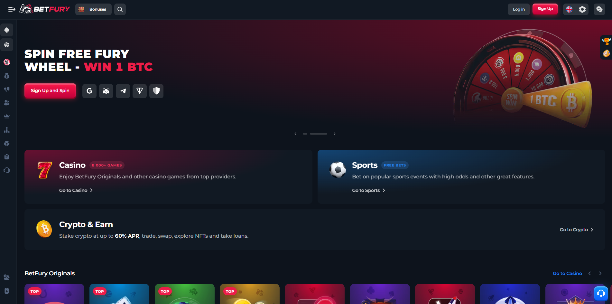
	<h3><u><strong><i>BetFury</i></strong></u></h3>
	

		BetFury is a comprehensive gaming ecosystem that combines a wide array of casino games, a dynamic sportsbook, and innovative crypto-earning features to deliver an engaging and immersive experience for users. I developed the platform with a focus on cross-chain functionality, leveraging Ethereum and Solana to ensure seamless interoperability and scalability across multiple blockchain networks. 
		Key features include staking mechanisms to reward users, real-time integration with the BETBY sportsbook API, and a variety of interactive gaming experiences designed to maximize engagement and retention. The platform emphasizes security, transparency, and speed, creating a trustworthy environment for both casual and professional gamers. 
		Built for growth, BetFury is designed to expand its game library, introduce new staking options, and enhance the mobile experience, making it accessible to a broader audience. By combining blockchain technology with innovative gaming features, BetFury establishes itself as a next-generation platform in the crypto gaming and betting space.
	

	

	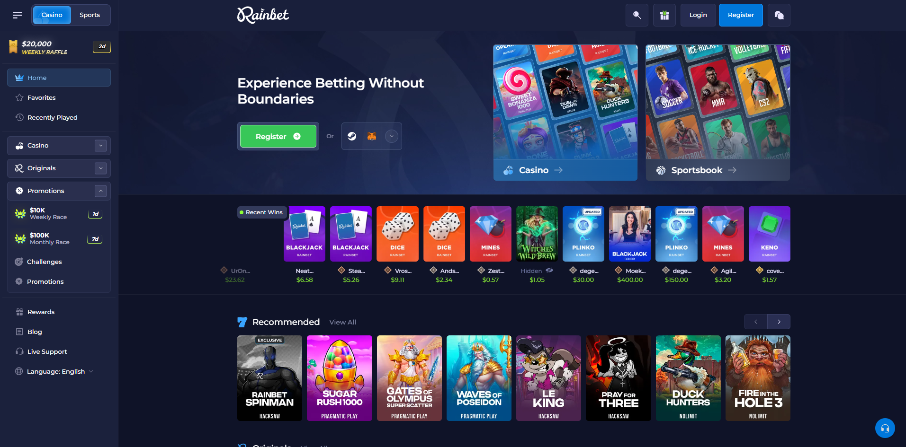
	<h3><u><strong><i>Rainbet</i></strong></u></h3>
	

		Rainbet is a blockchain-powered crypto casino and sportsbook designed to deliver a secure, transparent, and engaging gaming experience. The platform offers a wide range of slots, live games, and crypto betting, all backed by provably fair algorithms to ensure trust and fairness for every player. 
		I developed Rainbet with a focus on reliability and performance, integrating multi-crypto payment systems and a high-performance backend that supports instant transactions and real-time updates. The architecture ensures seamless interaction between users, games, and the blockchain, providing both speed and security in a decentralized environment. 
		Built for scalability and long-term growth, Rainbet has potential to evolve with AI-driven personalization, expanded game offerings, and enhanced mobile accessibility, creating a next-generation platform for crypto gaming enthusiasts worldwide.
	

	

	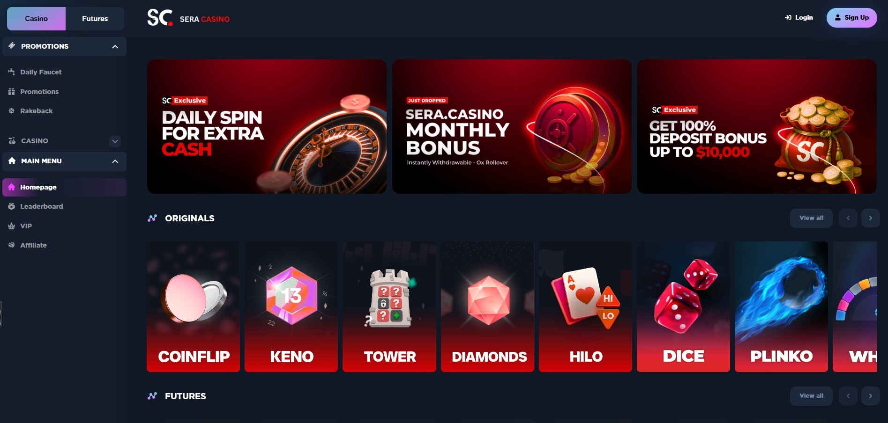
	<h3><u><strong><i>SERA.CASINO GAME</i></strong></u></h3>
	

		Sera.Casino is a Solana-based GambleFi/Web3 casino platform designed to deliver cryptocurrency-powered gaming experiences with provably fair (hash seed) games, futures betting, and a no-KYC access model. The platform operates on the Solana blockchain and utilizes its native $SC (Sera Token), with a total supply of 10,000,000,000 SC, enabling seamless in-platform transactions and active participation in the ecosystem. 
		Built on Web3 principles, Sera.Casino integrates blockchain-based game logic, crypto wallet interactions, and decentralized transaction flows, ensuring transparency and fairness across all gameplay mechanics. Key features include on-chain fairness verification, token utility integration, and decentralized access, positioning the platform as a pioneering entry in the emerging GambleFi sector of blockchain applications. 
		While the platform demonstrates innovation in decentralized gaming, public feedback has highlighted challenges in operational processes, including withdrawal disputes, account restrictions, and bonus requirement complexities. These insights underscore the importance of strong governance design, transparent smart contract logic, and user-protection mechanisms to enhance trust, usability, and long-term sustainability in Web3 gaming ecosystems.
	

	

	
	<h3><u><strong><i>Moomoo</i></strong></u></h3>
	

		Moomoo is a cutting-edge trading platform designed to empower investors with zero-commission trading and a comprehensive suite of tools to optimize their investment strategies. The platform delivers a seamless and engaging experience by combining real-time data streaming, interactive charting, and smooth integration with financial APIs, giving users access to a robust, professional-grade trading environment. 
		Built with modern web technologies and secure infrastructure, Moomoo ensures fast, reliable, and safe interactions while providing investors with the insights and capabilities needed to make informed decisions. The platform is designed for scalability and growth, with potential expansions including additional asset classes, enhanced mobile accessibility, and AI-driven analytics to deliver personalized investment recommendations tailored to individual users’ strategies. 
		By blending innovation, performance, and usability, Moomoo positions itself as a next-generation investment platform, democratizing access to advanced trading tools and empowering investors worldwide.
	

	

	
	<h3><u><strong><i>CryptoBlades</i></strong></u></h3>
	

		CryptoBlades is a decentralized RPG that leverages blockchain technology to give players the opportunity to earn SKILL tokens through strategic gameplay and NFT ownership. The platform combines immersive role-playing mechanics with decentralized finance, enabling users to mint, stake, and trade NFTs while participating in a tokenized in-game economy. 
		I developed a secure and scalable infrastructure across multiple blockchain platforms to ensure seamless gameplay, reliable NFT transactions, and a robust marketplace experience. Players can engage in battles, upgrade characters, and interact with the ecosystem in ways that reward both skill and strategy, creating a truly player-driven environment. 
		The platform is designed for long-term growth, with opportunities to expand through additional gameplay modes, enhanced cross-chain compatibility, and community-building features such as guilds and alliances. By blending entertainment, strategy, and blockchain innovation, CryptoBlades positions itself as a next-generation, play-to-earn RPG that empowers players while redefining digital ownership and value creation in gaming.
	

	

